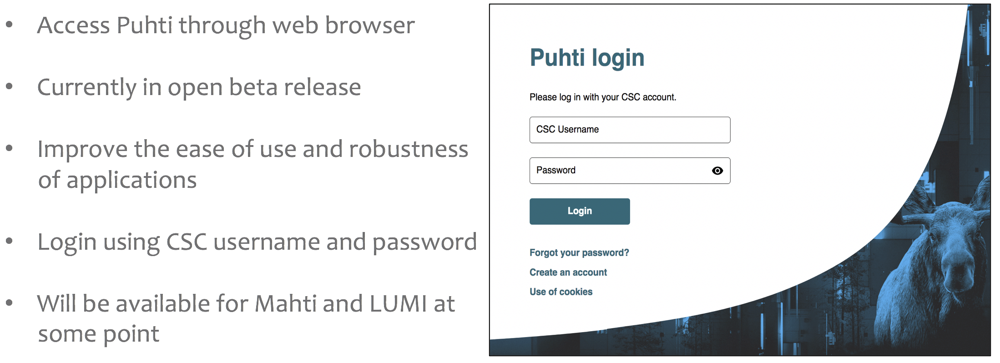

# Webinar: Recent updates on Puhti for biousers {.title}
<div class="column">

</div>
<div class="column">
<small>
All material (C) 2020-2022 by CSC -IT Center for Science Ltd.
This work is licensed under a **Creative Commons Attribution-ShareAlike** 4.0
Unported License, [http://creativecommons.org/licenses/by-sa/4.0/](http://creativecommons.org/licenses/by-sa/4.0/)
</small>
</div>

# Todays topics
- Puhti OS update
- Tykky Container wrapper
- Puhti web interface
- Short topics

# Puhti OS update

# Puhti OS update
- Puhti OS will be updated to RHEL8 on October 4.-5.
  - Better security
  - Better compatibility with new software
  - May cause issues with old software
- Will not affect your files ($HOME, /projappl, /scratch)

# Login
- General login address (puhti.csc.fi) will remain the same
  - Individual login node names will change
  - Only affects you if you e.g. have some script that contacts login nodes directly
- Host keys will change, and ssh will warn you about it first time you log in

# General software environment
- Python 2 no longer supported by system
  - Consider containers for software requiring Python 2
- Default compiler environment will be GCC (previously intel)
  - Intel compilers available as module
- Default MPI will be OpenMPI (previously hpcx-mpi)

# Software installed by CSC
- All bio software available now will be available also after update
  - Some things may still be missing, but will be added
- In some cases older versions are not installed by default
  - If you need a specific version, contact us at servicedek@csc.fi
- If something is missing or you encounter any problem, contact us

# Conda usage will be deprecated
- Conda has caused recurring problems
  - Installations generate huge amount of files
  - Causes high load on Lustre file system
  - Has caused problems and system-wide slow-downs
- https://docs.csc.fi/support/deprecate-conda/

# Replacing Conda
- Bioconda module will no longer be available
- CSC installed software currently accessed through bioconda will have their own modules
- Any user installations based on bioconda module will need to be re-installed
  - We recommend using Tykky container wrapper
  - More on Tykky later

# Example
Old commands:
  ```text
    module load bioconda
    source activate ipyrad
  ```

New:
  ```text
    module load ipyrad
  ```

# Container engine will be Apptainer
- Open-source version of Apptainer
- Old container images work as-is
- Old commands will work just as before
  - `singularity` and `singularity_wrapper` are links to `apptainer`and `apptainer_wrapper` respectively
- Environment varianles now starting with `SINGULARITY_` should be changed to `APPTAINER_`
  - Old variable names still work, but may give warnings

# Software installed by you: Binaries
- Software installed from ready binaries will work in most cases
- If you have problems see if RHEL8 compatible binary is available for download
- If working binary is not available, try compiling from source
- Installation in a container also an option
  - Especially if source code not available

# Software installed by you: Compiled software
- Most self compiled code will work, but needs to be tested
  - Usually on/off situation: if program starts, it should run fine
  - Common problems include linked libraries not found
- In case of problems, try re-compiling
- All MPI software should be re-compiled

# Software installed by you: Python, Perl, R, Java
- Python, Perl, R, Java etc applications should work
- Available modules may have changed
  - It is possible some previously available libraries are missing
  - If you notice something, plese contact us at servicedesk@csc.fi
- Container-based installations should work

# Test systems  
- Test system available:
  - https://csc-guide-preview.rahtiapp.fi/origin/puhti-rhel8/support/tutorials/puhti-rhel8-test/
- If you encounter any problems, contact us at servicedesk@csc.fi

# Easy way to install software - Tykky container wrapper

# Containers in a nutshell
- Containers are a way to package software with its dependencies (libraries, etc)
- Popular container engines include Docker, Apptainer/Singularity, Shifter
- Apptainer is the most popular in HPC environments
  - Apptainer can run most Docker containers

# Container benefits: Ease of installation
- Easy installation of complex software packages
  - Single-command installation if a ready container exists
  - Many developers distribute their software as containers
  - Third-party created containers available for many more
    - E.g. all packages in Bioconda repository also available 
    as containers 

# Container benefits: Environment isolation
- Containers use host system kernel, but can have their own Bins/Libs layer
  - Can be a different Linux distribution that the host
  - Can solve some incompatibilities
  - Less likely to be effected by changes in the host system
  
# Container benefits: Enviroment reproducibility
- Analysis environment can be saved as a whole
  - Useful with e.g. Python, where updating underlaying 
  libraries (Numpy etc) can lead to differences in behavior  
- Sharing with collaborators easy (single file)

# Container benefits: Portability
- Many containers can run as-is on any system with container support
  - Same container could run in Puhti, Mahti, LUMI, your own computer...
- Software requiring MPI will need suitable container for each system
  - Most bioscience applications are thread-based
- Sofware requiring GPU more portable than MPI, but may require modifications

# Container complications
- Building containers from scratch can be a bit tricky
  - Some operations require root acces on build system
- Running containerized applications requires special commands
- Care needed to make host system files visible inside the containers
  - Using `apptainer_wrapper` command takes care most of this

# Tykky container wrapper
- Provides an easy way to do containerised installations
- Creates wrappers for commands, so no special commands needed:
    Instead of e.g.

     ```text
     apptainer_wrapper exec myimage.sif myprog <options>
     ```
     
     just:
    
     ```text
     myprog <options>
     ```

# Using Tykky to install a Conda package
- "Bare" Conda installations are no longer allowed
  - Installations can have tens or hundreds of thousands of files
  - Leads to performance issues on Lustre
- Basic command to install into folder "MyEnv":

  ```
  mkdir MyEnv
  conda-containerize new --prefix MyEnv env.yml
  ```

# Environment file
- Typically provided with the software distribution
- Can be exported from an existing Conda environment
  
  ```
  conda env export -n <target_env_name> > env.yaml 
  ```

- Or written by hand
  
# Exanoke envirnment file:  
  ```text
  channels:
    - conda-forge
  dependencies:
    - python=3.8.8
    - scipy
    - nglview
  ```

# Using Tykky to install Python packages
- Basic command for pip -based installations:

  ```
  mkdir MyEnv
  pip-containerize new --prefix MyEnv req.txt
  ```

  - `req.txt`: pip requirements file
- By default uses the Python in current `$PATH` as base
  - Depends on loaded modules
  - Can not be a container-based installation
  - Using option `--slim` starts with a minimal Python installation

# Using Tykky to install Python packages, continued
- For Python software with no pip package available 
  - First create basic environment with `conda-containerize new`
  - Add installation command to a file, e.g. "post.txt"
  - Then use `conda-containerize update`

  ```
  conda-containerize update MyEnv --post-install post.txt 
  ```
  
    post.txt:
  
    ```
    python setup.py install
    ```

# Using Tykky to create wrapper for existing container
- Basic command:

  ```
  wrap-container -w </path/inside/container> <container> --prefix <install_dir> 
  ```

  - `-w` the directory/directories inside the container where the executables are
  - `container` can be a path to a container image file or an URL
  
  example:

  ```
  mkdir bbmap
  wrap-container -w /usr/local/bin docker://quay.io/biocontainers/bbmap:38.96--h5c4e2a8_1 \
  --prefix bbmap 
  ```

# More information in Docs

https://docs.csc.fi/computing/containers/tykky/


# Puhti web interface {.title}


# Puhti Web Interface: Introduction


           <p align="right"> <small> [Puhti web interface](https://www.puhti.csc.fi/public/login.html): Access some of applications on Puhti via browser </small> </p>


# Puhti Web Interface: Available features (1/2)

- Improved the main dashboard page layout
   - Apps available as pinned apps or on the top navbar under the *Tools* section
- Project-specific notifications
- Access shell on Puhti
   - Open a shell on the login node
   - Open a persistent shell on a compute node
- Graphical display of Lustre usage metrics
- Support for accelerated visualization


# Puhti Web Interface: Available features (2/2)

- Files
   - Use *Files* section to open file browser
   - Upload/download/create new files

- Active jobs
  - Submit batch jobs through the web interface
  - View recent and running batch jobs
  - Delete a running job

- Launching an interactive app

  - The interactive apps can be found "My Interactive Sessions" page
  - Desktop/Jupyter/RStudio/MATLAB/TensorBoard/Visual Studio Code

# Short topics {.title}

# Course: CSC Computing Environment
- Self learning course
  - https://ssl.eventilla.com/event/CSCCompEnvSelfLearn
  - Aimed at beginner to intermediate users
   - Also some advanced topics covered
- Materials available also directly:
  - https://csc-training.github.io/csc-env-eff/
  - Tutorials written to be self-standing introductions to topics
- Course is meant to complement CSC Docs pages

# Take home message {.title}

# Take home message
- OS update coming on Puhti
- Wrap Conda installations with Tykky
- Puhti web interface easy way to run graphical applications, Jupyter notebooks, Rstudio etc
- Self learning corse: CSC Computing Environment
